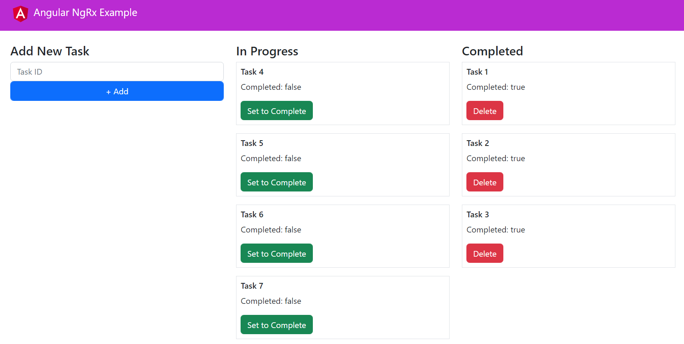
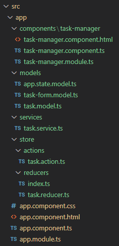

# Angular NgRx "Redux" Example

This project is using [Angular CLI](https://github.com/angular/angular-cli) version 15.0.0.

## Introduction
In this Task Manager example, I've used NgRx for reactivate state management. You can think of NgRx as a client-side cache or database. Angular NgRx is the equivalent of React Redux, but of course, NgRx is for Angular applications.



## Dependencies:
Install NgRx Store
```
$ npm i @ngrx/store
```

## Folder Structure
This is the folder structure I've set up in "src/app":




## Creating the Store

### Actions
Let's start with Actions: I've created 4 Task Actions / Action Types, these 4 Task Actions will be used to handle CRUD (Create, Read, Update, Delete) functionality.
#### task.action.ts
```typescript
import { Action } from '@ngrx/store';
import { ITask } from '../../models/task.model';

export enum TaskActionType {
    FETCH_TASKS = '[TASK] Fetch Tasks',
    ADD_TASK = '[TASK] Add Task',
    SET_TASK_TO_COMPLETE = '[TASK] Set Task To Complete',
    DELETE_TASK = '[TASK] Delete Task',
}

export class FetchTasksAction implements Action {
    readonly type = TaskActionType.FETCH_TASKS;
    constructor(public tasks: ITask[]) { }
}

export class AddTaskAction implements Action {
    readonly type = TaskActionType.ADD_TASK;
    constructor(public task: ITask) { }
}

export class SetTaskToCompleteAction implements Action {
    readonly type = TaskActionType.SET_TASK_TO_COMPLETE;
    constructor(public id: number) { }
}

export class DeleteTaskAction implements Action {
    readonly type = TaskActionType.DELETE_TASK;
    constructor(public id: number) { }
}

export type TaskAction = FetchTasksAction
    | AddTaskAction
    | SetTaskToCompleteAction
    | DeleteTaskAction;
```

### Reducers
In addition, we'll need a reducer to handle the state data changes. The TaskReducer consists of a switch statement that handles each Action Type and then returns the updated state.
#### task.reducer.ts
```typescript
import { ITask } from '../../models/task.model';
import { TaskAction, TaskActionType } from '../actions/task.action';

export const TaskReducer = (
    state: ITask[] = new Array<ITask>(),
    action: TaskAction
) => {
    switch (action.type) {
        case TaskActionType.FETCH_TASKS:
            return action.tasks;
        case TaskActionType.ADD_TASK:
            return [
                ...state,
                action.task
            ];
        case TaskActionType.SET_TASK_TO_COMPLETE:
            return state.map((task: ITask) => {
                if (task.id === action.id) {
                    task = { ...task, complete: true };
                }
                return task;
            });
        case TaskActionType.DELETE_TASK:
            return state.filter((task: ITask) =>
                task.id !== action.id
            );
        default:
            return state;
    }
}
```

## The Global Store
### Root Reducer
I've created a root reducer that maps the TaskReducer. You can bundle multiple reducers in the RootReducer map, but for simplicity, I'll just be showing you 1 example with TaskReducer.

#### reducers/index.ts
```typescript
import { ActionReducerMap } from '@ngrx/store';
import { IAppState } from 'src/app/models/app.state.model';
import { TaskReducer } from './task.reducer';

export const RootReducers: ActionReducerMap<IAppState, any> = {
    task: TaskReducer
};
```
### Enabling the Global Store
To enable the global store - all you have to do is set the following in @NgModule.imports in AppModule:

#### app.module.ts

```typescript
StoreModule.forRoot(RootReducers)
```

```typescript
import { NgModule } from '@angular/core';
import { BrowserModule } from '@angular/platform-browser';
import { AppComponent } from './app.component';
import { TaskManagerModule } from './components/task-manager/task-manager.module';
import { StoreModule } from '@ngrx/store';
import { RootReducers } from './store/reducers';

@NgModule({
  declarations: [
    AppComponent
  ],
  imports: [
    BrowserModule,
    TaskManagerModule,
    StoreModule.forRoot(RootReducers)
  ],
  bootstrap: [
    AppComponent
  ]
})

export class AppModule { }
```
The global store has now been enabled. It can be accessed and used throughout the application.

## Fetching Initial Data

I've created a mock API request in TaskService. The getInitialTaskData() method will be called in the ngOnInit lifecycle hook in TaskManagerComponent, which will set the initial task data to the store.

#### task.service.ts

```typescript
import { Injectable } from "@angular/core";
import { Observable, of } from "rxjs";
import { ITask } from "../models/task.model";

@Injectable()
export class TaskService {
    public getInitialTaskData(): Observable<ITask[]> {
        return of([
            { id: 1, complete: false },
            { id: 2, complete: false }
        ]);
    }
}
```
## TaskManagerComponent
#### task-manager.component.ts
```typescript
import { Component, OnInit } from "@angular/core";
import { Store } from "@ngrx/store";
import { Observable } from 'rxjs';
import { FormBuilder, FormControl, FormGroup, Validators } from "@angular/forms";
import { AddTaskAction, DeleteTaskAction, FetchTasksAction, SetTaskToCompleteAction } from '../../store/actions/task.action';
import { IAppState } from '../../models/app.state.model';
import { TaskService } from '../../services/task.service';
import { ITaskForm } from '../../models/task-form.model';
import { ITask } from '../../models/task.model';

@Component({
    selector: 'task-manager',
    templateUrl: './task-manager.component.html'
})

export class TaskManagerComponent implements OnInit {
    public taskData$: Observable<ITask[]> = this.store.select((store) => store.task);
    public form: FormGroup;

    constructor(
        private store: Store<IAppState>,
        private taskService: TaskService,
        private fb: FormBuilder
    ) {
        this.form = this.fb.group<ITaskForm>({
            id: new FormControl<number | null>(null, Validators.required)
        });
    }

    ngOnInit(): void {
        this.taskService.getInitialTaskData().subscribe(
            (data: ITask[]) => this.store.dispatch(new FetchTasksAction(data))
        );
    }

    public addTask(values: ITask): void {
        if (this.form.valid) {
            values.complete = false;
            this.store.dispatch(new AddTaskAction(values));
            this.form.reset();
        }
    }

    public deleteTask(id: number): void {
        this.store.dispatch(new DeleteTaskAction(id));
    }

    public setToComplete(id: number): void {
        this.store.dispatch(new SetTaskToCompleteAction(id));
    }
}
```

### Fetching Data from the Store:
The taskData$ Observable selects the task data from the store. Existing, new, or updated data will be outputted every single time on page load or when state changes have been made.
```typescript
public taskData$: Observable<ITask[]> = this.store.select((store) => store.task);
```
### Updating the Task State:
As you can see, TaskManagerComponent dispatches to the store (followed by an Action object) in the following methods: ngOnInit, addTask, deleteTask, and setToComplete.
```typescript
this.store.dispatch(new FetchTasksAction(data));
this.store.dispatch(new AddTaskAction(values));
this.store.dispatch(new DeleteTaskAction(id));
this.store.dispatch(new SetTaskToCompleteAction(id));
```
When we dispatch an action, it triggers a state change. The TaskReducer is called and will handle the state changes based on the given Action Type.

Once the state changes have been made, the updated task data will then be outputted from the store and set to taskData$.

## Wrap Up
I've provided an example of how NgRx works in Angular applications. To get a deeper understanding, I recommend you download this repo and play around with the user interface and code.

---

## Development server

Run `ng serve` for a dev server. Navigate to `http://localhost:4200/`. The application will automatically reload if you change any of the source files.

## Code scaffolding

Run `ng generate component component-name` to generate a new component. You can also use `ng generate directive|pipe|service|class|guard|interface|enum|module`.

## Build

Run `ng build` to build the project. The build artifacts will be stored in the `dist/` directory.

## Running unit tests

Run `ng test` to execute the unit tests via [Karma](https://karma-runner.github.io).

## Running end-to-end tests

Run `ng e2e` to execute the end-to-end tests via a platform of your choice. To use this command, you need to first add a package that implements end-to-end testing capabilities.

## Further help

To get more help on the Angular CLI use `ng help` or go check out the [Angular CLI Overview and Command Reference](https://angular.io/cli) page.
